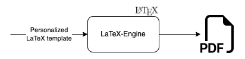

# Resume Builder

Welcome to Resume Builder. Currently, this app only handles the Personalized LaTeX template portion from the design below.

## Design
<p align="center">
 
</p>

<br/>

## Prerequisites
 
 * Docker
    * [LaTeX](https://latex-project.org/)

## Usage

1. Clone the repo to your local machine
2. Start the docker container
    ```bash
    docker-compose up -d
    ```
    **NOTE**: This will create a workspace directory within the directory you've cloned this repo to. You will be able to find all generate LaTeX files here.

3. Upload your template file (*.tex) and class file (*.cls) to the [workplace/templates](./workspace/templates/) directory.

4. open the container with
    ```bash
    docker exec -it resume_serivce bash
    ```

3. run this command to create your resume
    ```bash
    docker exec -it latex_engine latexmk -xelatex -output-directory=pdfs -cd templates/professional_cv/template.tex
    ```
4. view resume from the pdfs directory `./workspace/templates/professional_cv/pdfs`