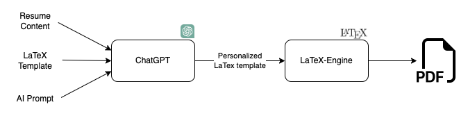

# Resume Builder

Welcome to Resume Builder. Currently, this app only handles the Personalized LaTeX template portion from the design below.

## Design
<p align="center">
 
</p>

<br/>

## Prerequisites
 
 * Docker
    * [LaTeX](https://latex-project.org/)

## Usage

1. Clone the repo to your local machine
2. Start the docker container
    ```bash
    docker-compose up -d
    ```
3. Upload your template file (template.tex) and class file (resume.cls) files to the [templates](./workspace/templates/) directory
4. open the container with
    ```bash
    docker exec -it resume_serivce bash
    ```

3. run this command to create your resume
    ```bash
    latexmk -pdf -output-directory=pdfs -cd templates/template.tex
    ```
4. view resume from the [pdfs](./workspace/pdfs) directory